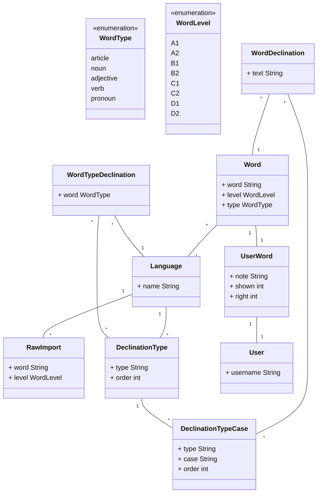

# Swift Language Study

This is a simple application made to make me easy to learn the declination of the words in german. 
The idea is importing a list of words that can be more or less assigned to a level, being able to fulfill the declinations
of that word, and then be able to randomly show diferent words with his declination. Also it will allow at some moment some autocompletion of declinations
or similar stuff to practice the word. 

Currently contains the base that I needed, I used some shortcuts to get to some usable version, I expect adding more features in the future. 

## Tables

## Work status

### Admin Sections
| Section | Model | Create | Modify | Delete |
| ------- | ------ | ------ | ------ | ------ |
| study | raw-import | [X] | [] | [] |
| study | languages | [X] | [X] | [] |
| study | declinations | [X] | [X] | [] |
| study | words-management | [X] | [] / [X] | [] / [X] |
| study | word-type <-> declinations | [] | [] | [] |
| profile | user | [x] | [x] | [] |

### View Sections
* [x] View random words/declinations filtered by language, level, word-type.
* [] Auto-complete form with random words.
* [] Set the correct declination type for the words.

### Todo
* Handle Profile/User errors with an enum, the view/template can transform into error messages
